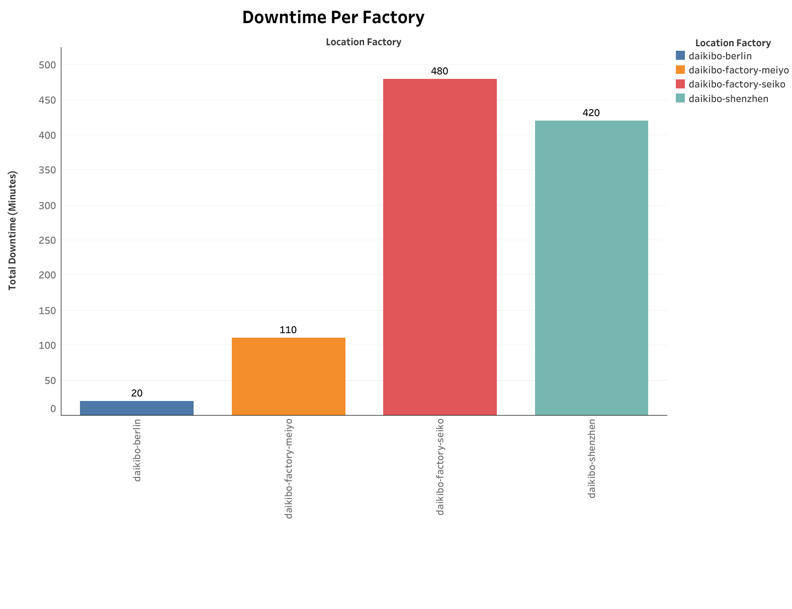
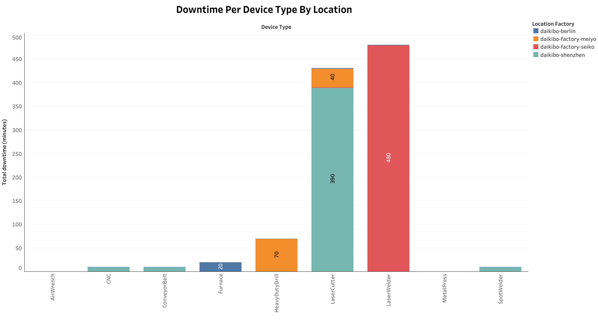
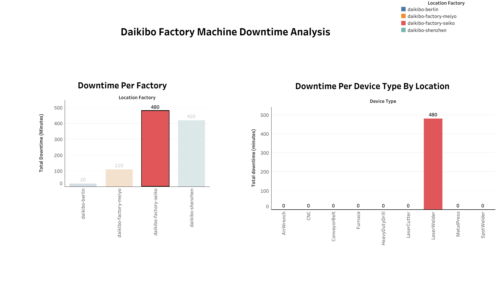

# 💼 Deloitte Data Analytics Virtual Experience (Forage)

Welcome to my completed project for the **Deloitte Data Analytics Virtual Experience** hosted on [Forage](https://www.theforage.com/). This simulation replicates real client-facing work at Deloitte, where I used **Tableau**, **Excel**, and **Python** to solve business problems and deliver actionable insights.

---

## 📌 Project Summary

**Client:** Daikibo Corporation – a global manufacturing company  
**Objective:** Analyze machine performance and HR equality scores to identify operational inefficiencies and fairness concerns  
**Tools Used:** Tableau Public, Excel, Python (Colab)  
**Skills Demonstrated:** Data wrangling, dashboard design, logic classification, stakeholder-focused storytelling

---

## 📊 Task 1: Machine Downtime Analysis (Tableau)

### 🧠 Problem
Daikibo's leadership team wanted to understand:
1. **Which factory had the most machine downtime?**  
2. **Which devices contributed most to breakdowns at that factory?**

### 🛠️ What I Did
- Flattened a complex telemetry JSON into a structured CSV using Python
- Calculated downtime: each `"unhealthy"` status = 10 minutes
- Built an interactive Tableau dashboard with:
  - Downtime per Factory chart
    
    <p align="center">
      
    </p>
    
  - Device Type chart (updates dynamically by selected factory)
 
   <p align="center">
      
   </p> 
    
- Enabled clear business exploration of machine issues by site

### 📈 Result
✅ **Osaka** was the worst-performing location  
✅ **LaserWelder** caused the most downtime there  
✅ Delivered a interactive dashboard

<p align="center">
  
</p>

👉 [Click here to view the interactive dashboard](https://public.tableau.com/views/Daikibo-Telemetry/Machine_Downtime_Analysis-DB?:language=en-US&:sid=&:redirect=auth&:display_count=n&:origin=viz_share_link)

---

## 🧮 Task 2: Equality Score Classification (Excel)

### 🧠 Problem
HR needed a way to interpret raw equality review scores and identify outliers or biased patterns in evaluations.

### 🛠️ What I Did
- Created a new column to classify scores as:
  - `Fair` (±10)
  - `Unfair` (< -10 or >10)
  - `Highly Discriminative` (< -20 or >20)
- Used a clear, scalable formula:
  ```excel
  =IF(ABS(A2)<=10, "Fair", IF(ABS(A2)<=20, "Unfair", "Highly Discriminative"))


## 💼 Let’s Connect

- 🔗 [LinkedIn](https://www.linkedin.com/in/kishan-patel-kp1629/)


> Thanks for visiting my portfolio! I'm actively seeking opportunities in data analytics, business analysis, or data science. Feel free to explore, star, and connect.
